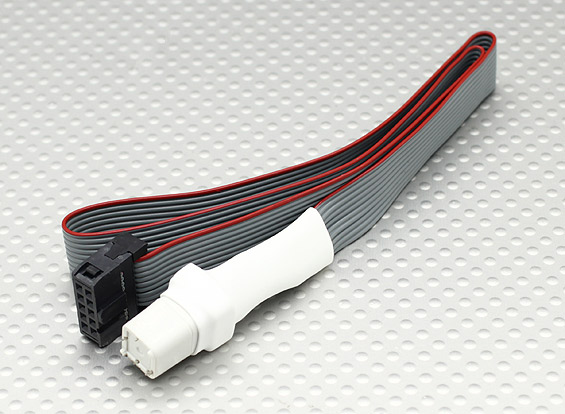
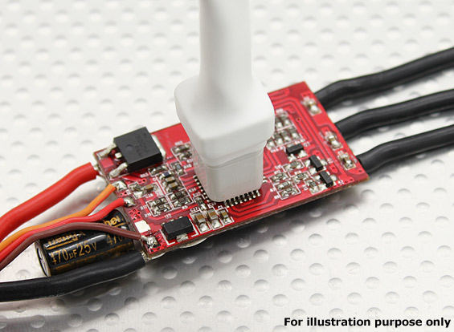

# [MinimOSD\_MK2](README.md) – Firmware

After assembling the board, the ATMega328p is probably blank from the factory.

The goal is to load the [MW\_OSD](http://www.mwosd.com) Arduino sketch into the device.

First the bootloader, then the sketch.

## Bootloader

The [standard Arduino bootloader for the ATMega328p](https://github.com/arduino/Arduino/blob/master/hardware/arduino/avr/bootloaders/atmega/ATmegaBOOT_168_atmega328.hex) is all that's required. Download it to your PC.

### ISP via Socket Tool

#### AVR ISP Programmer

Firstly you need an ISP Programmer that will bridge the firmware tools on your PC, with the MCU pins used for programming.

While this one is not cheap, it works well and is easily sourced: [Pocket AVR Programmer](https://www.sparkfun.com/products/9825) or [Amazon](http://www.amazon.com/gp/product/B004G54E9I?psc=1&redirect=true&ref_=od_aui_detailpages01)

It's convenient to use a USB extension cable, but either way plug it into your PC.

#### ATMega Socket Tool

This board is too small to take up space with ISP header pads or pins, so using a kind of socket tool that presses down on the pin shoulders will be required.

Hobby King sells the socket tool: [Atmel Atmega Socket Firmware Flashing Tool](https://www.hobbyking.com/hobbyking/store/uh_viewItem.asp?idProduct=27195)

Plug it in to the AVR ISP Programmer, making sure the pin aligment matches. Normally this is an orientation notch in the header, but it might only be the red strand of the ribbon cable.

#### Host Software

Your PC needs to control the ISP Programmer, and the swiss army knife of host software is `avrdude`.

On Mac OS X, an easy way to install it is to start with [Homebrew](http://brew.sh) and `$ brew install avrdude`.

### Fuses

First set the fuses:

Align the mark on the socket tool with the corner of pin 1 of the ATMega328p and press down evenly.

You should see the power light on the OSD illuminate; If not, double check the orientation of the socket tool.

Now issue this avrdude command to set the fuses:

    $ avrdude -c usbtiny -p atmega328p -v -e -U efuse:w:0x05:m -U hfuse:w:0xDA:m -U lfuse:w:0xFF:m

The console output should look something like this at the end:

    avrdude: safemode: lfuse reads as FF
    avrdude: safemode: hfuse reads as DA
    avrdude: safemode: efuse reads as 5
    avrdude: safemode: Fuses OK (E:05, H:DA, L:FF)
    
    avrdude done.  Thank you.
    

#### Bootloader

Now send the bootloader hex file to the MCU:

    $ avrdude -c usbtiny -p atmega328p -v -e -U efuse:w:0x05:m -U flash:w:ATmegaBOOT_168_atmega328.hex

And verify on the console that the write and verify was successfull:

    avrdude: input file ATmegaBOOT_168_atmega328.hex auto detected as Intel Hex
    avrdude: writing flash (32670 bytes):
    
    Writing | ################################################## | 100% 0.00s
    
    avrdude: 32670 bytes of flash written
    
    ...
    
    avrdude: verifying ...
    avrdude: 32670 bytes of flash verified

Now, remove the socket tool from the MCU; Power light turns off, and you're ready for USB connection.

## MW_OSD

Disconnect the AVR ISP Programmer from your PC.

Plug in a known-working Micro USB cable; You should see your power light illuminate again.

Now launch the [Arduino IDE](https://www.arduino.cc/en/Main/Software) and open the `MW_OSD.ino` file from the [MW\_OSD](http://www.mwosd.com) project.

Configure Arduino IDE

* "Tools" > "Board" > "Arduino Pro or Pro Mini"
* "Tools" > "Processor" > "ATMega328 (5V, 16MHz)"
* "Tools" > "Port" > "/dev/cu.SLAB\_USBtoUART"

_(On a Windows PC, you will need to choose the COM port of the CP2102 driver instead of "/dev/cu.SLAB\_USBtoUART".)_

Edit the `Config.h` file to match your aircraft. At the very least, make sure you choose the "CONTROLLER SOFTWARE" that you intend to use.

Now do "Sketch" > "Upload" to compile, build and upload the MW_OSD firmware to the OSD.

## MW\_OSD\_GUI

Remove the USB cable, and re-connect it to power-cycle the OSD.

Launch the MW\_OSD\_GUI application. Choose the same COM port as above, (or SLAB\_USBtoUART on Mac OS X) and the GUI app will attempt to communicate with the OSD.

A successful connection will show the "MSP:" command codes updating in the far-right column of the GUI app.